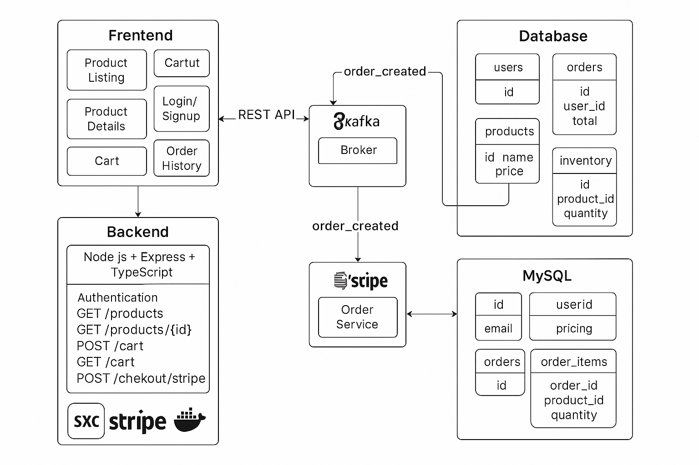

# 🛒 Full-Stack Product & Payment App

A full-stack, Dockerized application featuring multiple services that support product browsing, checkout, and secure Stripe-based payments—integrated with Kafka for event-driven order processing.



## 🔧 Services Overview

1. **🧾 Payment Service**  
   Handles payment processing via Stripe and publishes payment success events to Kafka:

   - Creates Payment Intents
   - Handles webhooks for payment confirmation
   - Publishes `payment.success` events to Kafka

2. **🛍️ UI Service (Frontend)**  
   A React + TypeScript + Vite application using Material UI to display products, manage the cart, and enable checkout.

3. **🗄️ MySQL Database**  
   Stores product listings, orders, and payment metadata.

4. **📡 Kafka Broker**  
   Handles communication between services:
   - Payment Service **produces** events
   - Order Service **consumes** and persists order data

---

## 📦 Tech Stack

| Layer     | Technology                                    |
| --------- | --------------------------------------------- |
| Frontend  | React, TypeScript, Vite, Material UI          |
| Backend   | Node.js, Express, Stripe SDK, KafkaJS         |
| Database  | MySQL                                         |
| Messaging | Apache Kafka                                  |
| DevOps    | Docker, Docker Compose, Kubernetes (optional) |

---

## 🚀 Features

- Browse products from a MySQL inventory
- Add/remove items in cart
- Secure Stripe checkout
- **Event-driven architecture** via Kafka
- Stripe **webhook** triggers `payment.success` event
- Orders created asynchronously upon payment confirmation
- TypeScript support and developer-friendly hot reload

---

## 🧾 Payment Service – Stripe & Kafka Integration

### ✅ Key Endpoints

| Method | Route                    | Description                                           |
| ------ | ------------------------ | ----------------------------------------------------- |
| POST   | `/create-payment-intent` | Creates a Stripe PaymentIntent                        |
| POST   | `/webhook`               | Handles Stripe events like `payment_intent.succeeded` |
| GET    | `/orders/:userId`        | Retrieves orders for a user                           |
| POST   | `/orders`                | Creates an order (optional pre-payment)               |

---

### 🔔 Webhook & Kafka Flow

1. Stripe triggers `payment_intent.succeeded`.
2. Service validates webhook and parses metadata.
3. Publishes `payment.success` event to Kafka.

```ts
// Stripe webhook handler (simplified)
if (event.type === "payment_intent.succeeded") {
  const intent = event.data.object as Stripe.PaymentIntent;

  const orderData = {
    paymentIntentId: intent.id,
    amount: intent.amount_received / 100,
    customerEmail: intent.receipt_email,
    status: "paid",
    createdAt: new Date().toISOString(),
  };

  await kafkaProducer.send({
    topic: "payment.success",
    messages: [{ key: intent.id, value: JSON.stringify(orderData) }],
  });
}
```

---

## 📡 Kafka Consumer – Order Service

Consumes `payment.success` events and creates orders in MySQL:

```ts
await kafkaConsumer.subscribe({ topic: "payment.success" });
await kafkaConsumer.run({
  eachMessage: async ({ message }) => {
    const data = JSON.parse(message.value?.toString() ?? "{}");
    await orderService.createOrderFromPayment(data);
  },
});
```

---

## 🗃️ Example `orders` Table

```sql
CREATE TABLE orders (
  id INT AUTO_INCREMENT PRIMARY KEY,
  user_id INT NOT NULL,
  product_id INT NOT NULL,
  status ENUM('pending', 'paid', 'failed') DEFAULT 'pending',
  payment_id VARCHAR(255),
  paid_at DATETIME,
  created_at DATETIME DEFAULT CURRENT_TIMESTAMP
);
```

---

## 🔐 Required Environment Variables

Set these in your `.env` file:

```env
PORT=3000
NODE_ENV=development
DB_HOST=localhost
DB_USER=youruser
DB_PASSWORD=yourpass
DB_NAME=ecommerce
DB_PORT=3306

STRIPE_SECRET_KEY=your_stripe_key
STRIPE_WEBHOOK_SECRET=your_webhook_secret

KAFKA_BROKERS=localhost:9092
KAFKA_CLIENT_ID=payment-service
```

---

## 🧩 Project Structure

```bash
├── payment-service/
│   ├── src/
│   │   ├── controllers/
│   │   ├── routes/
│   │   ├── services/
│   │   ├── kafka/
│   │   ├── entities/
│   │   └── index.ts
│   ├── Dockerfile
│   └── tsconfig.json
├── ui-service/
│   ├── src/
│   │   ├── components/
│   │   ├── pages/
│   │   └── App.tsx
│   ├── Dockerfile
│   └── vite.config.ts
├── docker-compose.yml
└── README.md
```

---

## ⚙️ Getting Started

### ✅ Prerequisites

- [Docker](https://www.docker.com/)
- Stripe test API keys
- Node.js (if running services outside Docker)

### 🚀 Run the App

```bash
docker-compose up --build
```

### 🔗 Access URLs

- 🛍️ Frontend: [http://localhost:5173](http://localhost:5173)
- 🧾 Payment API: [http://localhost:3000](http://localhost:3000)
- 📡 Kafka UI: [http://localhost:8080](http://localhost:8080)

---
